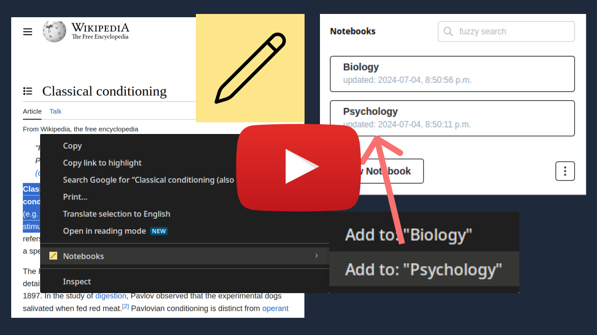

# Notebooks - Chrome Extension

## Overview

**Notebooks** is a Chrome extension that will improve your note-taking experience directly in the browser. It provides a interface to create, edit, and manage notebooks. Additionally, it has a unique feature to quickly appending selected text from any webpage to your a notebook of your choice.

## Features

- Fuzzy Search: Search through your notebooks by title or content.
- Context Menu Integration: Quickly add selected text from any webpage to your notebooks via the right-click context menu.
- Customizable Separator: Define a custom separator to be used when appending new content to existing notebooks.
- Download: Export all notebooks as plain text files compressed into a zip file.

## Installation

Since the extension is not published on the Chrome Web Store, you will need to manually install it. Follow these steps:

1. Download the Extension:

   - Go to the [releases page](https://github.com/zzDanDanzz/dans-notetaker-extension/releases) and download the latest release zip file containing the build folder contents (alternatively, clone the repo and run `npm install && npm run build` and the `dist` directory will be exactly what is in the release zip file).

2. Extract the Files

3. Load the Extension in Chrome:
   - Open Chrome and go to chrome://extensions/.
   - Enable Developer mode by toggling the switch in the top right corner.
   - Click on Load unpacked and select the directory where you extracted the files.

## What's Next

I plan on making some improvements I think would be useful (that is when I have some free time after work). examples: 

- a configurable keyboard shortcut that will add the selected text to the most recently modified Notebook without having to open the context menu and select the notebook 
- being able to import back the notes that you've exported 

## Contributing

Feel free to contribute to the project by submitting issues or pull requests

---

Notebooks was made with ❤️ by [Dan](https://github.com/zzDanDanzz).
